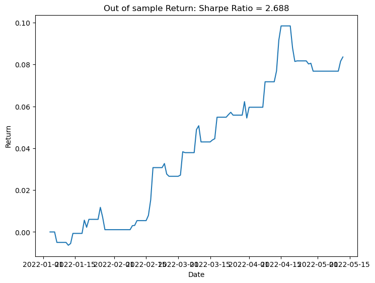
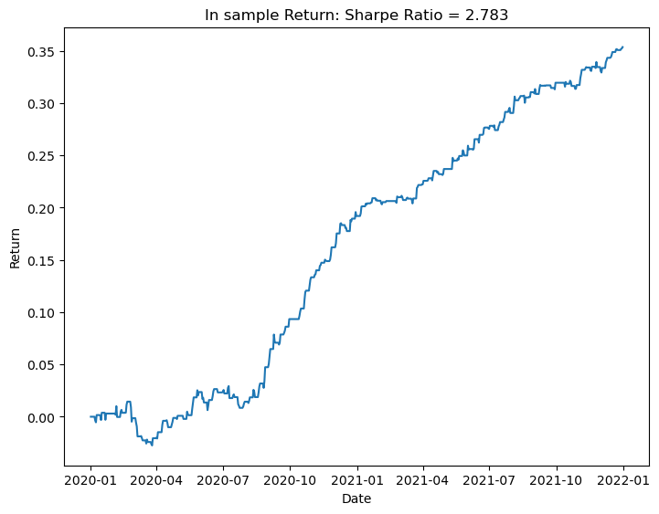
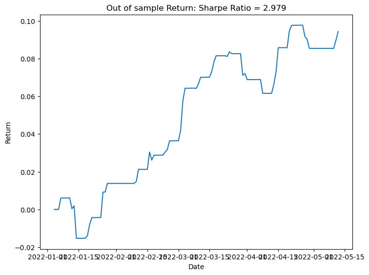
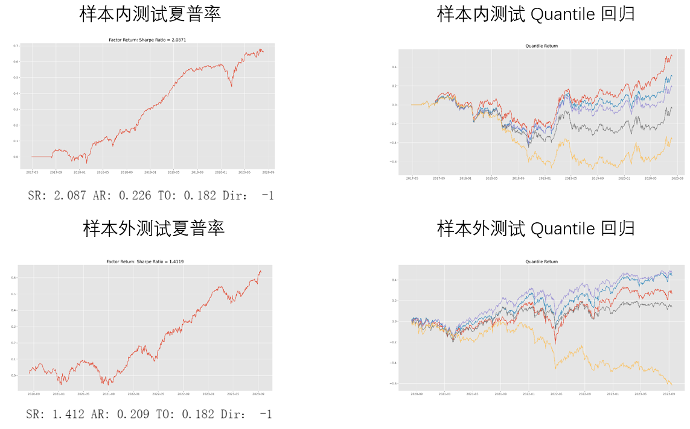

# 多因子量化交易策略

## 摘要

本实验报告基于多因子分析方法，构建了一个科学有效的量化投资策略，旨在获得尽量高收益率的因子组合。我们首先进行了行为金融学文献阅读，并结合券商研报，收集了多个高频和低频因子，这些因子都有相应的行为金融学理论依据。高频因子共8个；低频因子共5个, 总共13个因子。

之后, 我们详细描述了策略的前提、数据处理和因子构建过程。使用日频低频数据和分钟频高频数据中的多个数据项，结合公式进行代码实现。我们将数据分为样本内和样本外两部分，2017年4月28日至2019年10月15日的数据作为样本内数据，2019年10月16日至2022年5月12日的数据作为样本外数据。对单因子进行了收益率测试，评估了它们在样本内和样本外的表现。结果表明, 高频因子中的趋势强度因子在样本外达到了最高的夏普率(3.277). 此外, 我们对所有的高频因子和低频因子都进行了相关性分析, 并且与已有因子进行了查重, 因子之间的相关性均低于0.7.

在此基础上，我们对所创建的因子进行了因子组合，采用了夏普率组合和马科维茨组合两种方法。结果发现, 马科维茨方法在样本外能够达到2.346的夏普率, 适合作为组合方案.

总体而言，本次实验通过文献研究和研报阅读，选择了13个高频和低频因子，并使用高频和低频数据集进行了数据处理和因子构建，进行了单因子收益测试、因子相关性测试和因子查重。在此基础上，我们采用多种组合方法进行优化，制定了具有较高可实施性的量化投资策略，验证集夏普率可以达到2.346.

## 1. 策略前提

在传统金融学理论中，市场参与者被假设为完全理性且风险厌恶的个体，他们会在面对市场信息时做出最优决策，以最大化自身的效用。然而，行为金融学（Behavioral Finance）挑战了这一假设，认为投资者在实际决策过程中受到心理偏差和认知错误的影响，从而导致市场价格偏离其内在价值。行为金融学试图通过理解这些心理和行为偏差，来解释和预测金融市场中的异常现象和价格波动。

行为金融学的一个基本假设是，投资者的理性是有限的。即使拥有足够的信息，投资者也难以完全理解和处理所有信息，从而做出最优决策。这种有限理性使得投资者在面对复杂的市场环境时，往往依赖于启发式简化方法，这些方法虽然简化了决策过程，但也容易导致系统性的偏差。例如，投资者可能会过度依赖最近的信息，忽视长期趋势（代表性偏差），或者过度自信于自己的判断，低估市场风险（过度自信偏差）。

此外，行为金融学还认为投资者的决策常常受到情绪的影响。市场情绪，如贪婪和恐惧，可以导致价格大幅波动。当市场上涨时，投资者的乐观情绪可能会推动他们不断买入，从而形成资产价格泡沫；而当市场下跌时，恐慌情绪则可能导致投资者过度抛售，进一步加剧市场的波动。这种情绪驱动的非理性交易行为，进一步偏离了传统金融理论中的理性市场假设。

交易的实质不仅是买卖有形的资产，更是市场参与者之间的信息交换和情绪博弈。在行为金融学的视角下，交易的不仅仅是股票、债券等金融工具，更是市场参与者的预期、情绪和信念。投资者通过交易表达他们对市场未来走势的看法，而这种看法往往受到心理偏差和市场情绪的影响。因此，市场价格不仅反映了资产的基本面信息，还包含了大量投资者的行为和情绪因素。

通过理解这些行为金融学假设，量化交易策略可以更有效地捕捉市场的非理性行为和情绪波动。例如，某些因子可能代表了投资者的过度反应或反应不足，这些因子可以被纳入量化模型，以预测市场价格的短期波动和长期回归。最终，基于行为金融学的因子分析和量化交易策略，能够在更复杂和动态的市场环境中，寻找潜在的投资机会，获取超额收益。

## 2. 高频因子开发

### 2.1 高频收益方差因子

#### 2.1.1 策略前提

随着传统因子研究的不断深入，利用日级别数据来发现具有超额选股能力的因子变得越来越困难。因此，通过引入日内高频数据来刻画股票的日内特征，能够为选股模型增添新维度的信息和 Alpha。高频数据反映了市场微观结构和交易者行为的细微变化，这些变化在日级别数据中往往被掩盖。

高频收益分布特征，如方差、偏度和峰度，可以有效地捕捉股票在短时间内的波动性和极端事件的发生频率。具体来说，高频收益方差（Realized Variance, RVar）作为一个重要的统计量，能够刻画股票在分钟级别上的收益波动。行为金融学研究表明，投资者在面对频繁的价格波动时，可能会表现出过度反应或恐慌性抛售，这会导致市场短期波动性加剧。通过监测高频收益方差，投资者可以识别出市场中的异常波动，从而更好地管理风险和优化交易策略。

此外，高频收益方差还能够揭示市场流动性、交易摩擦和信息冲击等因素的影响。高频数据的细致刻画使得模型能够捕捉到日内的波动规律和交易者的行为模式，从而提供超越传统技术选股因子的额外选股能力。通过综合利用这些高频特征，投资者可以构建更具前瞻性的选股模型，提升投资组合的风险调整收益。

#### 2.1.2 因子构建

高频收益方差的计算方式有多种。本实验采取较为普遍的一种，将每个观测期的收益率的平方累加，具体公式为：
$$\mathrm{RVar_i}=\sum_{j=1}^Nr_{ij}^2$$
其中$r_{ij}$为基于股票i的高频收益序列。

#### 2.1.3 因子表现
高频收益方差因子的样本内和样本外的年化收益曲线为:

| 样本内                                            | 样本外                                            |
| ------------------------------------------------- | ------------------------------------------------- |
|  |  |

具体数据为:
- 样本内: `SR: 4.046 AR: 0.326 TO: 0.515 DIR: 1`
- 样本外: `SR: 2.688 AR: 0.162 TO: 0.532 DIR: 1`

高频收益方差因子的样本内与样本外分位数收益曲线为:
| 样本内                                           | 样本外                                           |
| ------------------------------------------------ | ------------------------------------------------ |
|  |  |

### 2.2 高频收益峰度因子

#### 2.2.1 策略前提

在传统投资理论中，收益率通常被假定为服从正态分布，并且可以完全由风险和收益构成。然而，实际市场中的股票收益往往具有时间序列相关性和非对称性，不同时间段的收益率可能呈现出不同的分布模式，如正态分布、偏态分布等。为了更准确地描述和捕捉这些特殊分布情况，需要引入一些能够反映收益分布特征的衍生因子，从而更全面地评估股票的风险和收益特征。

高频收益峰度因子（RKurt）衡量收益分布的峰态程度，即收益值集中在平均值周围的程度。高峰度通常表明收益分布具有尖峰特征，意味着极端收益事件的发生频率高于正态分布的假设。例如，在市场极端事件（如金融危机或重大政策变动）发生时，投资者的恐慌性抛售或抢购行为会导致收益分布出现尖峰，远离平均值的极端收益事件频繁出现。通过监测高频收益峰度，投资者可以识别出市场中的这种极端波动，从而在投资决策中考虑到潜在的风险和机会。

高频收益峰度因子不仅能够揭示市场的尖峰特征，还可以帮助识别市场的脆弱性和潜在的系统性风险。高峰度可能暗示市场处于不稳定状态，容易受到外部冲击的影响。结合高频收益方差和高频收益偏度因子，投资者可以构建更全面的风险收益评估模型，从而在不同市场条件下优化投资策略。

#### 2.2.2 因子构建

高频峰度因子衡量收益分布的峰态程度，其计算方法为对收益序列$r_{ij}$进行峰度统计量的计算，如以下公式：

$$
RKurt_i=\frac{N\sum_{j=1}^Nr_{ij}^4}{RVar_i^2} 
$$

#### 2.2.3 因子表现
高频收益峰度因子的样本内与样本外年化收益曲线为:

| 样本内                                            | 样本外                                            |
| ------------------------------------------------- | ------------------------------------------------- |
|  |  |

具体数据为:
* 样本内: `SR: 3.554 AR: 0.209 TO: 0.925 DIR: -1`
* 样本外: `SR: 2.29 AR: 0.119 TO: 0.956 DIR: -1`

高频收益峰度因子的样本内与样本外分位数收益曲线为:

| 样本内                                           | 样本外                                           |
| ------------------------------------------------ | ------------------------------------------------ |
|  |  |

### 2.3 高频收益偏度因子

#### 2.3.1 策略前提

高频收益偏度因子（RSkew）衡量收益分布的非对称性，即收益值相对于平均值的分布不均匀情况。正偏度通常表明收益分布具有较多的大正收益，负偏度则表明收益分布具有较多的大负收益。

#### 2.3.2 因子构建

高频收益偏度因子衡量收益分布的非对称性。其计算方法为对收益序列$r_{ij}$进行偏度统计量的计算。

$$ RSkew_i=\frac{\sqrt{N}\sum_{j=1}^Nr_{ij}^2}{RVar_i^{3/2}} $$

#### 2.3.3 因子表现
高频收益偏度因子的样本内与样本外年化收益曲线为:

| 样本内                                            | 样本外                                            |
| ------------------------------------------------- | ------------------------------------------------- |
|  |  |

具体数据为:
- 样本内: `SR: 2.261 AR: 0.101 TO: 1.03 DIR: -1`
- 样本外: `SR: 2.614 AR: 0.104 TO: 1.043 DIR: -1`

高频收益偏度因子的样本内与样本外分位数收益曲线为:

| 样本内                                           | 样本外                                           |
| ------------------------------------------------ | ------------------------------------------------ |
|  |  |

### 2.4 五分钟特质残差峰度因子

#### 2.4.1 策略前提

高频数据分析揭示了市场微观结构下的复杂动态行为。特质残差是指某种交易量、价格或其他度量值从其期望值或均值的偏离程度。通过分析五分钟特质残差的峰度，可以捕捉市场短期内的极端波动事件，这些事件通常由突发的市场信息或交易者行为引发。

当期残差波动率不仅与未来的收益偏离度水平正相关，而且对未来的收益偏离度和波动水平均具备一定的预测能力。通过监测五分钟特质残差峰度，投资者可以识别市场中的极端波动事件，从而在投资决策中考虑潜在的风险和机会，优化投资策略。

#### 2.4.2 因子构建

五分钟特质残差峰度因子是在五分钟时间窗口内的特质残差的峰度。特质残差通常是指某种交易量、价格或其他度量值从其期望值或均值的偏离程度。其计算方法为，先用实际值减去期望值计算出特质残差，再使用滚动窗口计算五分钟内特质残差的峰度。具体公式如下：

$$ K_t=\frac{1}{N}\sum_{i=0}^{N-1}(\frac{R_{t-i}-\mu}{\sigma})^4 $$

其中$R_t$为在时间点t的残差。

#### 2.4.3 因子表现

五分钟特质残差峰度因子的样本内与样本外年化收益曲线为:
| 样本内                                                  | 样本外                                                   |
| ------------------------------------------------------- | -------------------------------------------------------- |
|  | ! |

具体数据为:
- 样本内: `SR: 2.783 AR: 0.121 TO: 1.025 DIR: -1`
- 样本外: `SR: 1.982 AR: 0.074 TO: 1.055 DIR: -1`

五分钟残差峰度因子的样本内娱样本外分位数收益曲线为:

| 样本内                                                 | 样本外                                                 |
| ------------------------------------------------------ | ------------------------------------------------------ |
|  |  |

### 2.5 上下午成交量比值因子

#### 2.5.1 策略前提

上下午成交量比值因子是衡量成交量日内分布的因子之一。股票市场的日内成交量通常呈现出特定的模式。在全球股市，日内模式往往呈现“U”型，即上午开盘和下午收盘是存在两个高峰。在我国股市，由于存在午间休市，日内成交量模式通常呈现“W”型，即在上午开盘、午后开盘以及收盘前的时点，成交量会出现三个明显的高峰。上午开盘时，由于投资者对隔夜信息的反应，成交量通常较高；午后开盘时，因新的市场信息和午间交易策略调整，成交量也会出现一个小高峰；而在收盘前，投资者调整持仓，成交量再次上升。

对股票日内的成交量分时研究，“W”的三个峰值前后时点的成交量值得重点关注。

#### 2.5.2 因子构建

上下午成交量分布因子衡量上午开盘后和下午开盘后的成交量比值。用股票交易的分钟数据，预处理后得到上午开盘后的成交总量，以及下午开盘后的成交总量，使用简单移动平均（MA）和指数加权移动平均（EMA）分别构造选股因子。如以下两个公式所示：

简单移动平均：
$$VR_{MA}=\frac{1}{d}\sum_{i=1}^d(\frac{VOL_{morning}}{VOL_{afternoon}})_{t-i}$$

指数加权移动平均：
$$VR_{EMA}=\frac{1}{d}\sum_{i=1}^d\omega_{t-i}(\frac{VOL_{morning}}{VOL_{afternoon}})_{t-i}$$

对两种方式得到的因子分别进行单因子测试，选取夏普率较高的EMA方法。

#### 2.5.3 因子表现
上下午成交量比值因子的样本内和样本外年化收益曲线为:
| 样本内                                                | 样本外                                                |
| ----------------------------------------------------- | ----------------------------------------------------- |
|  |  |

具体数据为:
- 样本内: `SR: 2.451 AR: 0.156 TO: 0.927 DIR: 1`
- 样本外: `SR: 2.181 AR: 0.115 TO: 0.966 DIR: 1`

上下午成交量比值因子的样本内和样本外分位数收益曲线为:
| 样本内                                               | 样本外                                               |
| ---------------------------------------------------- | ---------------------------------------------------- |
|  |  |

### 2.6 一分钟ILLIQ因子

#### 2.6.1 策略前提

ILLIQ因子（Amihud Illiquidity Ratio）衡量的是股票的价格变动相对于其交易额的比率。具体来说，它是某一时间段内绝对收益率与交易额的比值，用于评估市场流动性。

流动性较差的股票通常需要给予投资者更高的预期收益作为补偿，称为流动性溢价。ILLIQ因子较高的股票流动性较低，可能需要更高的风险溢价，投资者可以利用这一信息进行资产配置和收益预测。高ILLIQ值表示小额交易即可导致较大价格变动，表明市场冲击成本高。交易者可以通过监测ILLIQ因子提前识别流动性风险，优化交易执行策略，降低冲击成本。

流动性较差的股票在交易时容易产生较大滑点，即实际成交价格与预期价格之间的差异。通过监测ILLIQ因子，投资者可以选择流动性较好的时段或分批交易，减少滑点和交易成本。ILLIQ因子还反映市场深度，即市场消化大额交易的能力。高ILLIQ值的股票市场深度较浅，投资者可以通过调整交易规模和时机，避免在市场深度不足时进行大额交易。

#### 2.6.2 因子构建

其计算公式为：

$$ILLIQ_i=\frac{|R_i|}{Amount_i}$$

其中$|R_i|$是第i分钟的绝对收益率。

#### 2.6.3 因子表现
一分钟ILLIQ因子的样本内与样本外年化收益曲线为:

| 样本内                                           | 样本外                                           |
| ------------------------------------------------ | ------------------------------------------------ |
|  |  |

具体数据为:
- 样本内: `SR: 1.724 AR: 0.124 TO: 0.522 DIR: 1`
- 样本外: `SR: 1.131 AR: 0.066 TO: 0.486 DIR: 1`

一分钟ILLIQ因子的样本内与样本外分位数收益曲线为:

| 样本内                                          | 样本外                                          |
| ----------------------------------------------- | ----------------------------------------------- |
|  |  |

### 2.7 趋势强度因子

#### 2.7.1 策略前提

趋势强度因子（Trend Strength）衡量股票价格在日内趋势的强弱。它通常通过计算涨跌幅和波动性的比值来评估价格走势的强度。也可以理解为日内价格位移与路程之比。

趋势强度因子可以帮助识别强劲的价格趋势，趋势交易者可以根据这一因子选择进入或退出市场的时机。在高趋势强度时，市场可能出现持续的单边行情，投资者可以调整仓位以管理风险。

#### 2.7.2 因子构建

趋势强度的计算方式为计算1日内涨跌幅和累积波动幅度的比值。具体公式如下：

$$TrendStrength=\frac{P_N-P_1}{\sum_{i=2}^N(|P_i-P_{i-1}|)_t}$$

其中$P_t(t=1, 2, ..., N)$为t日1分钟频率的价格序列。

#### 2.7.3 因子表现
趋势强度因子的样本内和样本外年化收益曲线为:

| 样本内                                        | 样本外                                        |
| --------------------------------------------- | --------------------------------------------- |
|  |  |

具体数据为:
- 样本内: `SR: 2.78 AR: 0.23 TO: 0.82 DIR: -1`
- 样本外: `SR: 3.277 AR: 0.323 TO: 0.981 DIR: -1`

趋势强度因子的样本内和样本外分位数收益曲线为:

| 样本内                                       | 样本外                                       |
| -------------------------------------------- | -------------------------------------------- |
|  |  |

### 2.8 五分钟交易量分布因子

#### 2.8.1 策略前提

五分钟交易量分布因子（Five-Minute Volume Distribution）衡量的是股票在每五分钟时间窗口内的成交量分布情况。该因子通过比较特定时间段（如上午开盘后和下午收盘前）的成交量来描述日内交易活动的分布概况。

通过研究五分钟交易量分布因子，可以揭示市场参与者在不同时间段的交易行为。了解日内交易量的分布，有助于识别市场活动，从而优化交易时机，避免在流动性不足的时段进行大额交易。

#### 2.8.2 因子构建

五分钟交易量分布因子的计算公式为：

$$ FVD=\frac{1}{5}\sum_{i=1}^5\frac{Volume}{\sum_{j=1}^N{Volume_j}}$$

#### 2.8.3 因子表现
五分钟交易量分布因子的年化收益曲线为:
| 样本内                                                | 样本外                                                |
| ----------------------------------------------------- | ----------------------------------------------------- |
|  |  |

具体数据为:
- 样本内: `SR: 1.975 AR: 0.122 TO: 0.945 DIR: -1`
- 样本外: `SR: 2.979 AR: 0.183 TO: 1.015 DIR: -1`

五分钟交易量分布因子的分位数收益曲线为:

| 样本内                                               | 样本外                                                |
| ---------------------------------------------------- | ----------------------------------------------------- |
|  |  |

### 2.9 高频因子相关性分析
所有高频因子的相关系数矩阵如下 (红色表示该行最高相关性, 蓝色表示该行最低相关性):

同时, 我们还将高频因子与已有的12个因子进行了查重, 查重结果显示高频因子与已有因子的相关性均低于0.7:

## 3. 低频因子开发

### 3.1 市场情绪因子

#### 3.1.1 策略前提
行为金融学理论认为，股票市场的价格并不完全由基本面决定，股票市场的大幅上涨与公众的过度乐观存在显著的相关性。投资者情绪的刻画指标多种多样，各有优劣，我们选择技术分析常用的情绪指标ARBR。ARBR情绪因子策略是一种将行为金融学原理融入投资决策的策略，主要关注市场行为的心理学层面。该策略认为，投资者的情绪和心理因素可以显著影响股票价格和市场走势。通过使用情绪分析工具来评估市场或特定证券的情绪，策略旨在识别因情绪波动引起的市场风险，并利用这些情绪偏差来预测市场运动。策略假设市场并非总是有效的，因此通过识别和理解这些非效率性，投资者可能实现超越平均水平的回报。此外，策略还包括使用定量数据来建立模型，更准确地预测市场动向，从而在情绪波动较大时做出更审慎的投资决策。

#### 3.1.2 因子构建
在构建ARBR情绪因子时，我们需要使用每日最高价、每日开盘价、每日最低价三项数据。AR人气指标是以当天开盘价为基础与当天之最高、最低价比，依公式统计算出来的强弱指标，又可称为买卖人气指标。AR刻画的是市场交易人气，人气越旺，股价越高，而股价攀升带来的赚钱效应又会不断带动人气上。BR意愿指标以昨天的收盘价为基础与今天的最高、最低价比较，依公式计算出来的强弱指标，又可称为买卖意愿指标。BR反映的是市场交易意愿，以“反市场心理”为基础，当市场人气狂热时卖出，人气悲观时买进。
具体来说，AR人气指标的计算公式为最近N天内最高价与开盘价的差的和除以开盘价与最低价的差的和，具体公式为：
$$\mathrm{AR}=\frac{\sum_{i=1}^N(H_i-O_i)}{\sum_{i=1}^N(O_i-L_i)}\times100$$
BR人气指标的计算公式为最近N日内，若某日的最高价高于前一天的收盘价，将该日最高价与前收的差累加到强势和中，若某日的最低价低于前收，则将前收与该日最低价的差累加到弱势和中。最后用强势和除以弱势和，所得比值放大100。具体公式为：
$$\mathrm{BR}=\frac{\sum_{i=1}^N(H_i-YC_i)}{\sum_{i=1}^N(YC_i-L_i)}\times100$$
得到AR和BR指标后，我们利用两者之差构建ARBR情绪因子：
$$f_1=AR-BR$$

#### 3.1.3 因子表现
测试市场情绪因子ARBR在样本内和样本外的表现，测试结果如下图所示。

具体数据为：
样本内：SR：2.964，AR：0.171，T0：0.043，Dir：1
样本外：SR：2.021，AR：0.125，T0：0.043，Dir：1

### 3.2 市场趋势因子

#### 3.2.1 策略前提
市场趋势对市场中投资者的决策行为有着重要的影响，投资者会受到群体行为的影响，进一步改变其投资决策，进而对股票价格产生影响。我们主要考虑市场活跃度和短期内市场价格变动情况两个因素带来的影响。

根据市场活跃度与交易量的关系，高交易量通常反映了市场参与者对特定股票的强烈兴趣和高频度的交易活动。这种情况可能由行为经济学中的群体行为效应驱动，即投资者趋向于追随他人的行动，从而推动股票价格上涨。此外，高交易量也暗示着大量资金可能流入市场，支持价格上涨趋势。

相反，低交易量可能反映出市场参与者对该股票兴趣的减弱，可能因为投资者对股票前景的信心下降或其他市场条件不利。这种情况在行为经济学中可以理解为投资者的群体行为逆向效应，即趋向于避开或减少持有少见买卖活动的股票，从而导致价格下跌。

此外，观察短期内收盘价与开盘价的差值也提供了关于市场情绪和短期价格变动的线索。正的差值表明当天市场情绪积极，可能受到投资者乐观预期和买入行为的推动，反映出一定的上涨趋势。相反，负的差值则暗示市场情绪消极，可能由于投资者对未来走势的担忧而导致的卖出压力，可能预示价格下跌。

综上所述，综合考虑市场活跃度、交易量和短期价格变动，可以帮助投资者理解市场的行为模式与趋势，并基于此制定相应的投资策略，以更好地应对市场波动和变化。
#### 3.2.2 因子构建
市场活跃度因子，市场中过去一段时间的交易量可以反映并引导市场的未来趋势：
$$f2=\mathrm{ts_Mean}(\mathrm{Volume},N)=\frac1N\sum_{i=0}^{N-1}\mathrm{Volume}_{t-i}$$
短期价格变动因子，收盘价与开盘价的差值可以反映市场的情绪与当日内价格的短期变动：
$$f3=\mathrm{ts_Mean}(\mathrm{Close}-\mathrm{Open},N)=\frac1N\sum_{i=0}^{N-1}(\mathrm{Close}_{t-i}-\mathrm{Open}_{t-i})$$
#### 3.2.3 因子表现
测试市场活跃度因子和短期价格变动因子在样本内和样本外的表现，测试结果如下图所示。
市场活跃度因子：

具体数据为：
样本内：SR：2.132，AR：0.186，T0：0.024，Dir：-1
样本外：SR：1.049，AR：0.128，T0：0.024，Dir：-1
短期价格变动因子：

具体数据为：
样本内：SR：2.087，AR：0.226，T0：0.182，Dir：-1
样本外：SR：1.412，AR：0.209，T0：0.182，Dir：-1

### 3.3 日收益波动因子

#### 3.3.1 策略前提
日收益波动因子（DRV）通过计算每日股票收益率的标准差来衡量股票价格的波动性。在量化模型中，该因子用于帮助投资者理解市场的波动情况，从而调整投资策略。构建过程中，先计算每日收益率，然后利用滚动窗口计算这些收益率的标准差，标准差越大，表示波动性越大，风险也越高。策略性地，高波动性通常意味着潜在的高风险和高回报，投资者可以根据该因子选择合适的交易时机和风险管理策略，比如在波动性低时进行买入，在波动性高时进行卖出或避险操作。
#### 3.3.2 因子构建
首先，计算每日的收益率，通常是用当日的收盘价除以前一日的收盘价，再减去1。然后，利用一个滚动窗口（例如30天）计算这些日收益率的标准差。具体公式为：
$$\sigma(\frac{\text{Close}*t}{\text{Close}*t-1}-1)$$
#### 3.3.3 因子表现
测试日收益波动因子在样本内和样本外的表现，测试结果如下图所示。

### 3.4 低频因子相关性分析
所有低频因子的相关系数矩阵如下：

## 4. 多因子组合与回测

### 4.1 多因子组合方法简介

在量化分析中，多因子组合是一种重要的策略，旨在利用多个经济、财务或市场技术指标来构建投资组合，以优化投资表现并管理风险。多因子模型的核心理念是，单一因子可能无法全面解释资产收益的变化，而多个因子的组合能够更全面地捕捉市场的复杂性和动态变化。

首先，选择合适的因子至关重要。这些因子可以来自于不同的数据源和信息类型，例如公司财务报表、市场价格数据、交易量、市场情绪指标等。基本面因子如公司收入增长率、市盈率和资产负债表数据，技术因子如移动平均线交叉和相对强弱指标，以及情绪因子如投资者情绪调查和市场波动率等，都是常见的选择。

其次，多因子组合的设计考虑到每个因子对投资组合的贡献以及它们之间的相关性。通过因子分析和回归分析等技术，可以确定每个因子在不同市场条件下的有效性和稳定性。例如，一些因子可能在牛市表现突出，而在熊市则可能失效，因此需要综合考虑因子的动态表现。

在实际操作中，多因子组合通常涉及权重分配的问题。常见的方法包括等权重组合、根据因子预测能力分配权重（如夏普比率加权）、以及基于优化理论的方法如马科维茨组合。这些方法旨在最大化投资组合的预期收益或者在给定风险水平下最小化风险。

在多因子组合中, 有两种常见的因子组合方式:

* 夏普加权组合:  夏普加权组合是一种用于构建投资组合的方法，其核心思想是根据各资产或因子的夏普比率来分配权重。夏普比率是由诺贝尔奖得主威廉·夏普提出的一种衡量投资组合每单位风险所产生的超额回报的指标，通常用来评估资产或策略的风险调整后的表现。在夏普加权组合中，每个资产或因子的权重与其夏普比率成正比。具体而言，夏普比率较高的资产或因子将被分配更高的权重，以期在给定的风险水平下实现更高的预期回报。这种方法的优势在于能够最大化投资组合的整体夏普比率，从而达到在风险控制下获取最佳收益的目标。
* 马科维茨方法: 马科维茨方法是现代投资组合理论的基础，其主要目标是通过合理分配资产，达到投资组合的最优化。这一方法由哈里·马科维茨于1952年提出，对金融领域的影响深远。其核心思想在于通过权衡投资组合的风险和回报，实现在给定风险水平下的最大化预期回报，或者在给定预期回报下的最小化风险。

### 4.2 夏普加权组合样本外策略表现

经过夏普加权后的投资组合的年化收益曲线为:

分位数收益曲线为:

具体数据是: `SR: 1.374 AR: 0.084 TO: 0.863 DIR: -1`

### 4.3 马科维茨方法样本外策略表现

经过马科维茨方法求得的投资组合的年化收益曲线是:

分位数收益曲线是:

具体数据是: `SR: 2.346 AR: 0.178 TO: 0.993 DIR: -1`

## 5. 策略总结

我们设计的策略是基于多因子组合的选股策略, 加权后的因子组合最高能在样本外达到2.346的夏普率, 未来可以在如下几个方面改进:
- 增加优质高频因子及低频因子的数目.
- 可利用自动化调参工具 (例如`optuna`) 对因子参数进行进一步优化.
- 可以利用机器学习方法进行因子组合.
